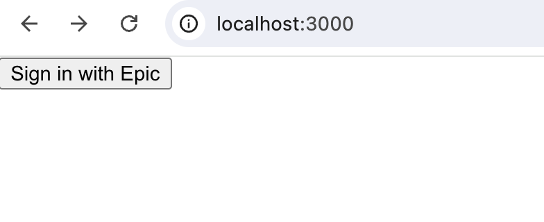
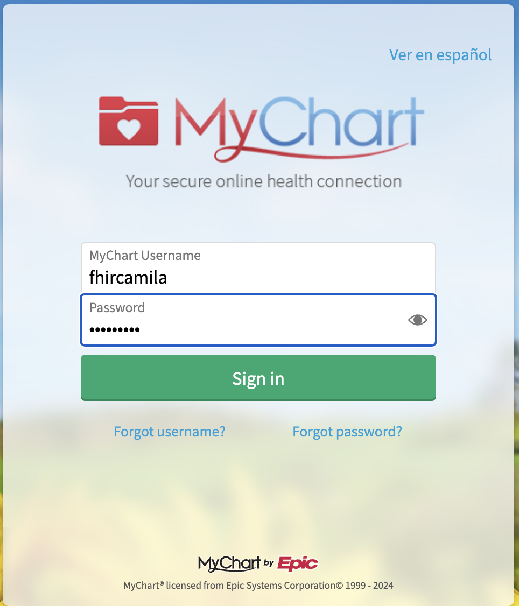
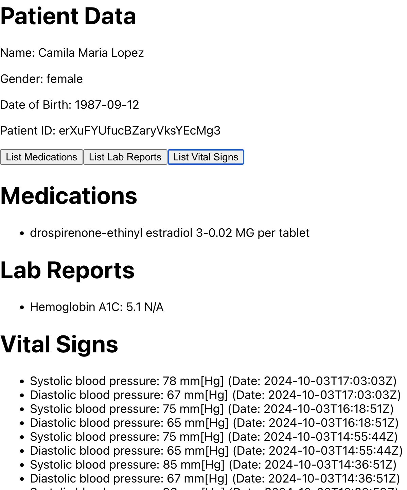

# A super simple version of a SMART on FHIR app that integrates with Epic.

To try the app:

1. Obtain a test account available in the [documentation](https://fhir.epic.com/).

2. Setup this React project and run `npm start`

3. Click on the buttons to retrieve meds, lab reports and vitals.

Screenshots:

- Before Login
  
- Epic OAuth
  
- Post Login
  
